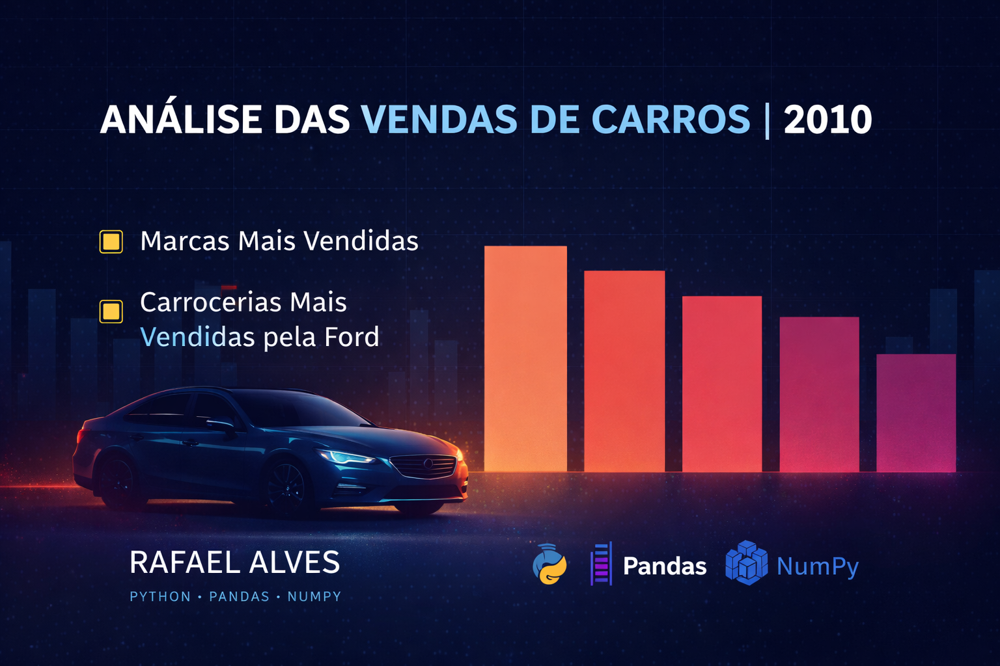

<p align="center">
  
</p>


#  Análise das Marcas e Carrocerias Mais Vendidas em 2010
### Autor: **Rafael Alves dos Santos**
### Curso: **Banco de Dados — Inteligência Analítica**
### Linguagem: **Python**
### Ambiente: **Jupyter Notebook**

---

##  Sobre o Projeto

Este projeto realiza uma **Análise Exploratória de Dados (EDA)** utilizando o dataset **`car_prices.csv`**, com foco em entender:

-  **As marcas mais vendidas no ano de 2010**
-  **Os tipos de carroceria (“body types”) mais vendidos pela Ford em 2010**

A análise inclui:
- Limpeza de dados  
- Filtragem por ano e marca  
- Contagem de valores  
- Visualização com gráficos  
- Uso de boas práticas em Data Science  

---

##  Habilidades Demonstradas

✔️ Manipulação de dados com **Pandas**  
✔️ Visualização com **Matplotlib** e **Seaborn**  
✔️ Filtragem inteligente com **Lambda + loc**  
✔️ Tratamento de valores ausentes  
✔️ Storytelling com dados  
✔️ Documentação profissional de projeto  

---

##  Estrutura do Projeto

##  Tecnologias Utilizadas

- **Python 3**
- **Pandas** – limpeza e manipulação dos dados  
- **NumPy** – suporte matemático  
- **Matplotlib** – criação de gráficos  
- **Seaborn** – visualização estatística avançada

##  Bibliotecas Utilizadas

- **Pandas**
- **Numpy**
- **Matplotlib**
- **Seaborn**

---

## Como Reproduzir o Projeto

1. Baixe o repositório:
```bash
git clone: 

## Autor

**Rafael Alves dos Santos**  
Estudante de Banco de Dados – 3º semestre  
Foco em Inteligência Analítica e Construção de Portfólio  

---

## Contato

- GitHub: https://github.com/Rafael0314  
- LinkedIn: https://www.linkedin.com/in/rafaelalvesxdatabase/ 
- Email: rafaelalvesdossantosx@gmail.com

